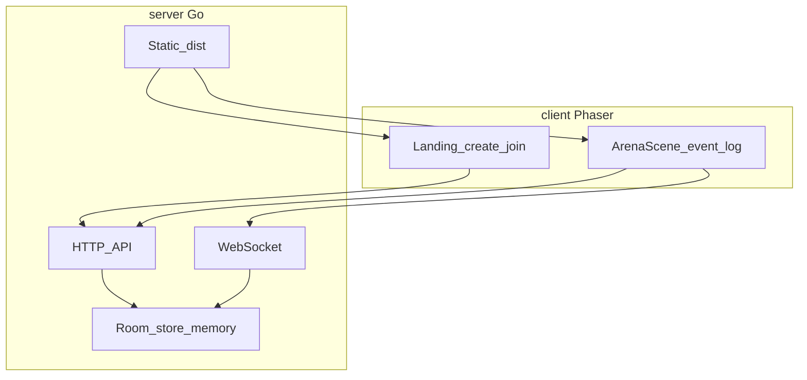

# Архитектура (высокий уровень)

## Назначение

Многопользовательская браузерная игра с **авторитетным сервером** для сессий (комнат), в перспективе — фазы ретро и состояние «арены».  
Транспорт: [ADR 0001](adr/0001-network-stack.md). Сервер: [ADR 0002](adr/0002-server-runtime.md). Клиентский рендер: [ADR 0003](adr/0003-client-rendering-phaser.md).

## Монорепо

| Каталог | Содержимое |
|---------|------------|
| `server/` | Go: HTTP API, WebSocket, in-memory state, **статика** из embed FS после `client` build. |
| `client/` | Vite, TypeScript, **Phaser 3** — лендинг (создать/подключиться) и **сцена арены** (лог, далее геймплей). |

Сборка: отдельно `go build` (сервер) и `npm run build` (клиент); CI/Docker **копирует** `client/dist` в образ сервера **или** использует multi-stage.

## Компоненты (логика)

- **HTTP API** — создание комнаты; static **GET** с `index.html` для **SPA** на `/`, `/g/*`, `/join/*` — см. [PROTOCOL](PROTOCOL.md) (код в **path**, не в query).
- **WebSocket** — комнатные события: v0.1 **join/leave** и **лог**; далее — фазы, карточки, движение.
- **Static** — доставка **SPA** (`client` bundle).
- **Store** — в памяти (v0.1); БД — позже (ADR).

## Сценарий как конфиг (продукт v0.2+)

- **Сценарий** — данные: `id`, локация, ассеты, порядок фаз ([REQUIREMENTS](REQUIREMENTS.md)).

## Владение состоянием

- **Сервер** — источник правды: членство в комнате, **в перспективе** ведущий, фаза, карточки, голоса.
- **Клиент** — отображение и **намерения** (команды по WebSocket/HTTP согласно `PROTOCOL`).

## Связанные документы

- [REQUIREMENTS.md](REQUIREMENTS.md), [CJM.md](CJM.md), [MVP.md](MVP.md) — **v0.1** (группы + лог) vs **v0.2+** (ретро).
- [NFR.md](NFR.md), [E2E.md](E2E.md).
